  
  
  
  

## What I do

## How I work

## Tools I reach for

 

<picture>
  <source media="(prefers-color-scheme: dark)" srcset="https://raw.githubusercontent.com/CipherBoi007/CipherBoi007/output/snake-dark.svg">
  
</picture>

  

