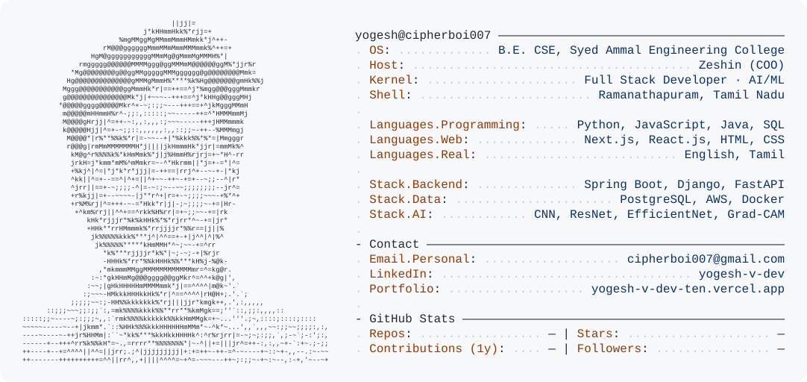

<a href="https://yogesh-v-dev-ten.vercel.app">
  <picture>
    <source media="(prefers-color-scheme: dark)" srcset="./hero_dark.svg">
    
  </picture>
</a>

  

<a href="https://yogesh-v-dev-ten.vercel.app">
  <picture>
    <source media="(prefers-color-scheme: dark)" srcset="./dark_mode.svg">
    
  </picture>
</a>

  

<picture>
  <source media="(prefers-color-scheme: dark)" srcset="https://raw.githubusercontent.com/CipherBoi007/CipherBoi007/output/snake-dark.svg">
  
</picture>
